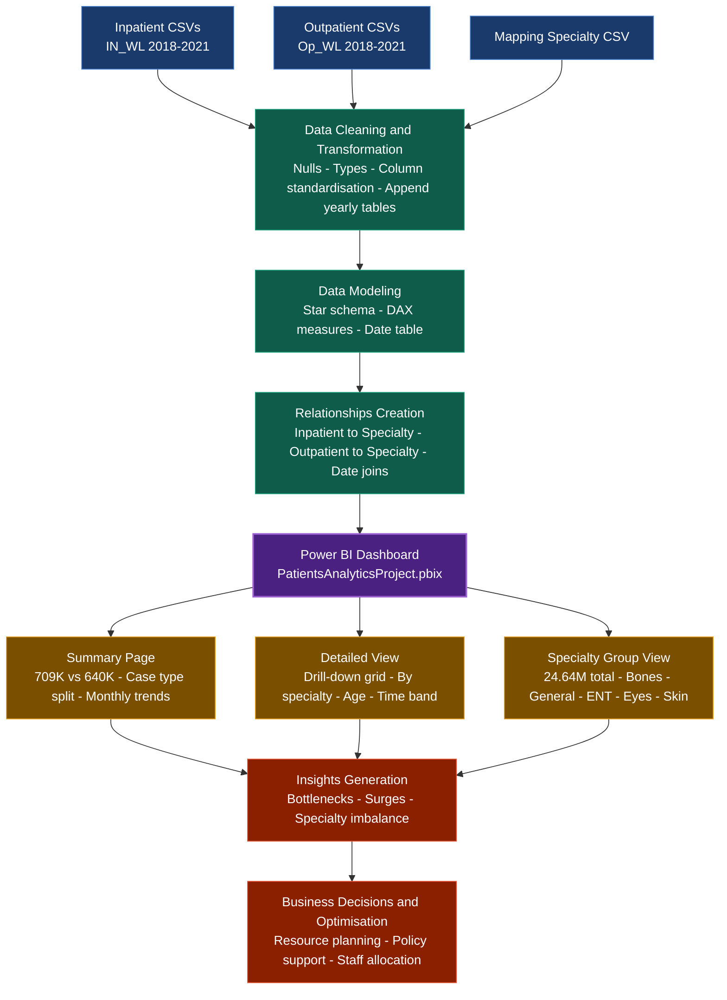
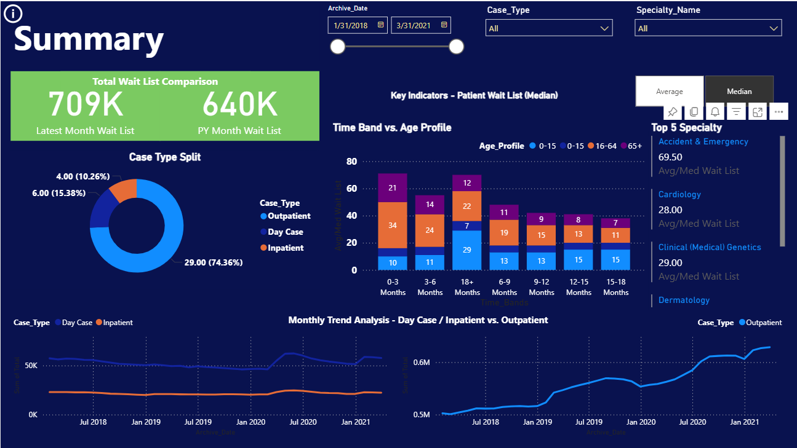
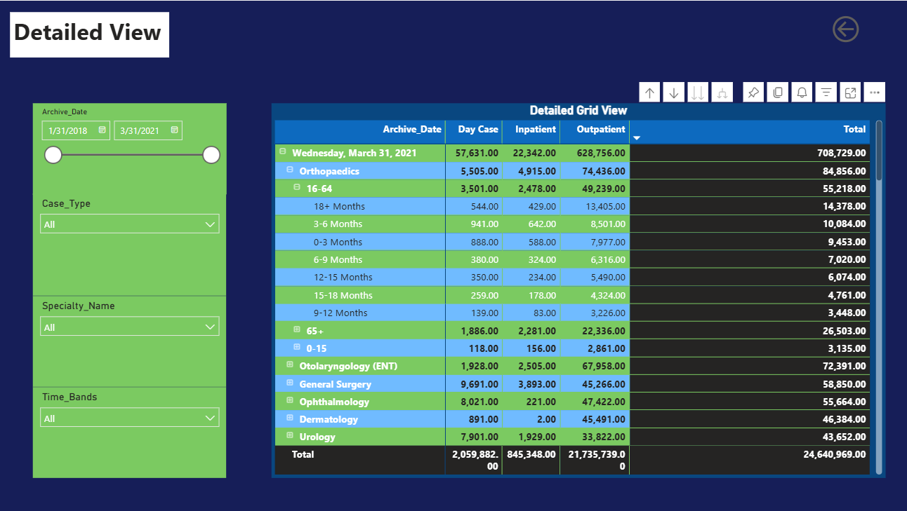

# 🏥 Healthcare Patient Waiting List Analysis

> **Power BI Dashboard Project** | Data Analytics Portfolio

---

## 📌 Project Overview

This end-to-end data analytics project analyzes **healthcare patient waiting lists** across Ireland from **2018 to 2021**, covering inpatient, outpatient, and day case demand. The goal is to uncover trends, identify bottlenecks, and support data-driven decision-making for hospital resource planning.

The project covers the full data pipeline — from raw CSV ingestion to an interactive Power BI dashboard with drill-down visuals across specialties, age groups, time bands, and case types.

---

## 🔢 Key Numbers (From Dashboard)

| Metric | Value |
|---|---|
| Latest Month Wait List | **709K** |
| Previous Year Month Wait List | **640K** |
| YoY Increase | **+10.8%** |
| Total Records (2018–2021) | **24.64 Million** |
| Total Outpatient Records | **21.73 Million** |
| Total Inpatient Records | **845K** |
| Total Day Case Records | **2.06 Million** |
| Outpatient share of total | **~88%** |
| Top Specialty (Orthopaedics) | **84,856 patients** |

---

## 🗂️ Project Structure

```
Healthcare-WaitingList-Analytics/
│
├── Inpatient/
│   ├── IN_WL 2018.csv
│   ├── IN_WL 2019.csv
│   ├── IN_WL 2020.csv
│   └── IN_WL 2021.csv
│
├── OutPatient/
│   ├── Op_WL 2018.csv
│   ├── Op_WL 2019.csv
│   ├── Op_WL 2020.csv
│   └── Op_WL 2021.csv
│
├── Mapping Speciality/
│   └── Mapping_Specialty.csv
│
├── PowerBI/
│   └── PatientsAnalyticsProject.pbix
│
└── README.md
```

---

## 📂 Dataset Description

### 1. Inpatient Data (`IN_WL 2018–2021.csv`)
Records of patients admitted to hospital and placed on a waiting list. Contains specialty, age group, time band, and total count per archive date.

### 2. Outpatient Data (`Op_WL 2018–2021.csv`)
Records of patients awaiting a first outpatient consultation. Dominates the dataset at ~88% of total volume (21.73M records).

### 3. Specialty Mapping (`Mapping_Specialty.csv`)
Lookup table mapping individual specialties to broader groups: **Bones, General, ENT, Eyes, Skin** — used for the specialty group drill-down visual.

---

## 🔄 Data Pipeline Flowchart



---

## 📊 Dashboard Pages & Visuals

### Dashboard 1



### Dashboard 1 — Summary
- **KPI Cards:** Latest Month Wait List = **709K** | PY Month Wait List = **640K**
- **Case Type Split (Donut chart):** Outpatient **74.36%** · Day Case **15.38%** · Inpatient **10.26%**
- **Time Band vs. Age Profile (Stacked bar):** Highest volume in 0–3 months band; age group 16–64 dominates across all bands
- **Top 5 Specialties (Median wait):** Accident & Emergency (69.50) · Clinical Genetics (29.00) · Cardiology (28.00)
- **Monthly Trend Lines:** Inpatient/Day Case flat ~50K | Outpatient rising sharply from 0.5M → 0.6M+ by Jan 2021
- **Filters:** Archive Date slider · Case Type · Specialty Name

### Dashboard 2

### Dashboard 2 — Detailed View
- **Drill-down matrix table** by Archive Date → Specialty → Age Group → Time Band
- **March 31, 2021 snapshot:** Total = **708,729** | Day Case = 57,631 | Inpatient = 22,342 | Outpatient = 628,756
- **Top specialties by total:**
  - Orthopaedics: **84,856**
  - Otolaryngology (ENT): **72,391**
  - General Surgery: **58,850**
  - Ophthalmology: **55,664**
  - Dermatology: **46,384**
  - Urology: **43,652**
- **Grand Total across all years:** 24,640,969

### Dashboard 3 — Specialty Group Drilldown
- **Sum of Total: 24.64M** across all years and case types
- **By Specialty Group (horizontal bar chart):**
  - Bones: ~4M (highest)
  - General: ~3.8M
  - ENT: ~3.5M
  - Eyes: ~2M
  - Skin: ~1.8M

---

## 🔑 Key Insights (Data-Backed)

1. **709K patients** on the waiting list in March 2021 vs **640K** same month prior year — a **+10.8% YoY increase**, showing the healthcare system is under growing pressure.

2. **Outpatient demand overwhelms the system** — 21.73M out of 24.64M total records (88%) are outpatient, suggesting primary care redirection is urgently needed.

3. **Orthopaedics is the single biggest bottleneck** — 84,856 patients in March 2021 alone, with the 16–64 age group accounting for 55,218 of those cases.

4. **Long-wait patients (18+ months) are significant** — In Orthopaedics, the 18+ months time band shows 14,378 patients (16.9% of the specialty's total), signaling chronic under-capacity.

5. **Outpatient trend is accelerating** — Monthly trend rose sharply from ~0.5M (mid-2018) to over 0.6M (Jan 2021) while inpatient/day case stayed flat at ~50K.

6. **Bones & General specialty groups dominate** at ~4M and ~3.8M respectively out of 24.64M total, pointing to where surgical investment would have the highest impact.

---

## 🛠️ Tools & Technologies

| Tool | Purpose |
|---|---|
| Power BI Desktop | Dashboard development and visualization |
| Power Query (M Language) | Data extraction, cleaning, transformation, appending yearly CSVs |
| DAX | KPI measures, YoY comparison, median/average toggle |
| Microsoft Excel / CSV | Raw data source format |
| Git & GitHub | Version control and portfolio sharing |

---

## 🧠 DAX Measures Used

```dax
-- Latest Month Wait List
Latest Month Total =
CALCULATE(
    SUM('All_Data'[Total]),
    'All_Data'[Archive_Date] = MAX('All_Data'[Archive_Date])
)

-- Previous Year Same Month
PY Same Month =
CALCULATE(
    SUM('All_Data'[Total]),
    SAMEPERIODLASTYEAR('Date'[Date])
)

-- Average Wait List
Avg Wait List = AVERAGE('All_Data'[Total])

-- Median Wait List
Median Wait List = MEDIAN('All_Data'[Total])
```

---

## 🚀 Use Cases

- **Hospital resource planning** — Orthopaedics & ENT need immediate capacity review
- **Policy decision support** — 18+ month wait band data backs funding proposals
- **Patient flow management** — Time band analysis helps triage prioritisation
- **Performance benchmarking** — YoY KPI cards show directional trend at a glance
- **Specialty investment decisions** — Bones & General groups = highest ROI for new hires

---

## 📈 Future Improvements

- [ ] Real-time data integration via hospital APIs
- [ ] ML-based forecasting for waiting list demand (Python + Azure ML)
- [ ] Automated ETL pipeline using Python (Pandas + Power BI Dataflow)
- [ ] Row-level security (RLS) for department-level access
- [ ] Power BI Embedded deployment as public web dashboard

---


## 👨‍💻 Author

**Nihal Jaiswal**
Data Analytics | Power BI | Python | SQL
